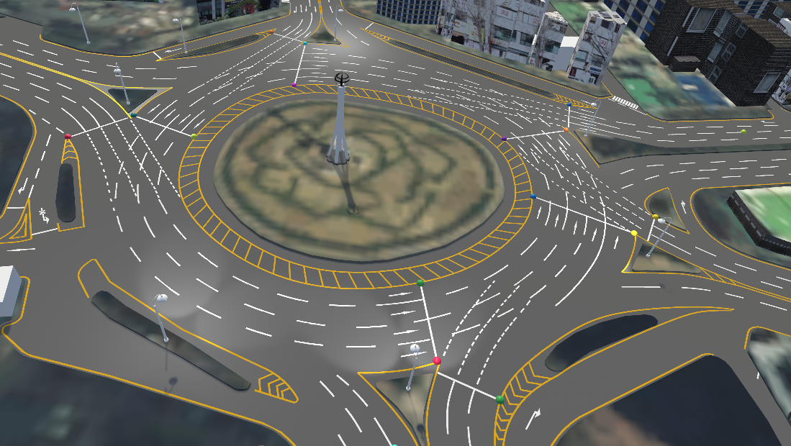
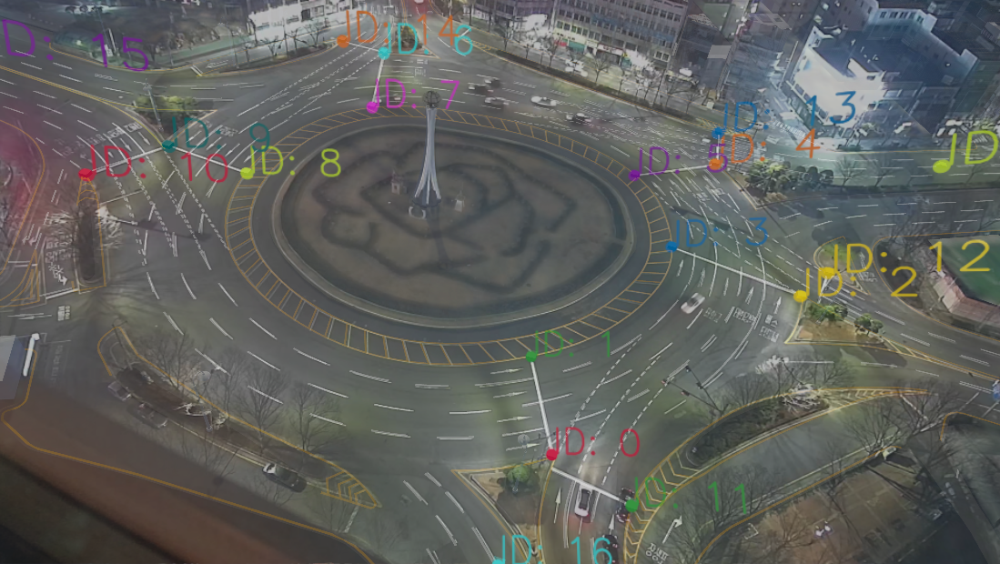

# GADT
GADT is a camera calibration tool utilizing digital twin based on genetic algorithm. Below figures show the motivation and calibration results. To install this package, follow requirments setup. Demo and using with your custom digital twin environment can be also used for calibration, following instructions.

  
  
  

## Requirements Setup

### Install Unity

### Install packages assets
Install OpenCvSharp package

Install TextMesh Pro package

### Install Plugins
Ookii.Dialogs.dll and System.Windows.Forms.dll for window explorer

opencv_videoio_ffmpeg4100_64.dll for video uploader

## Demo
For demo, we provide the part of a digital twin environment, Gongeoptap DT. 

## Custom Environments

## Cite
